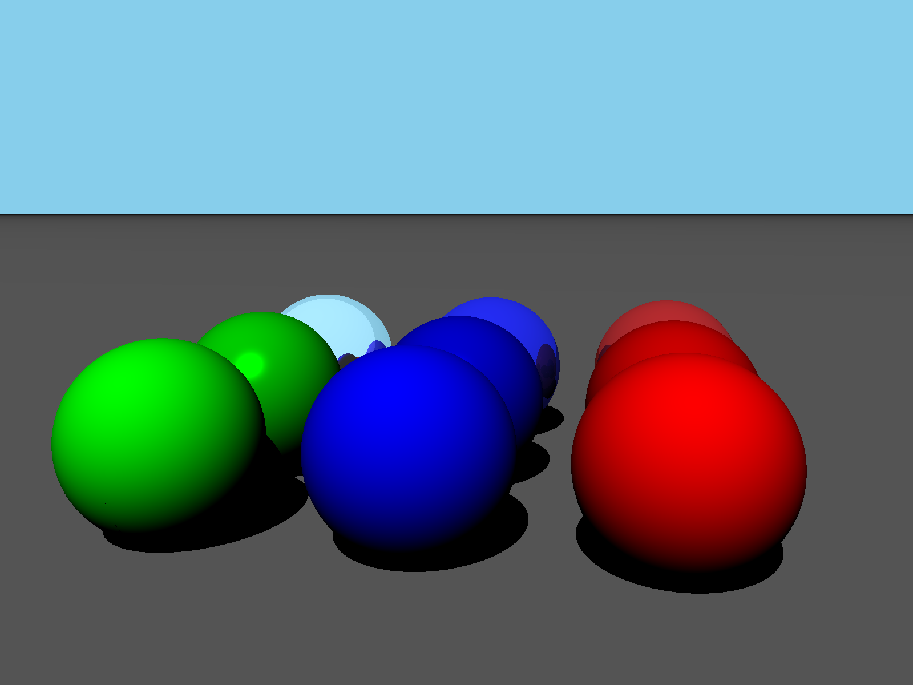
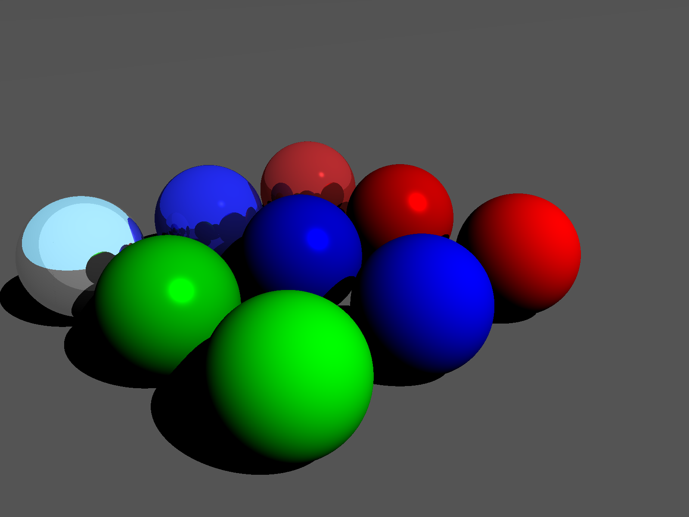
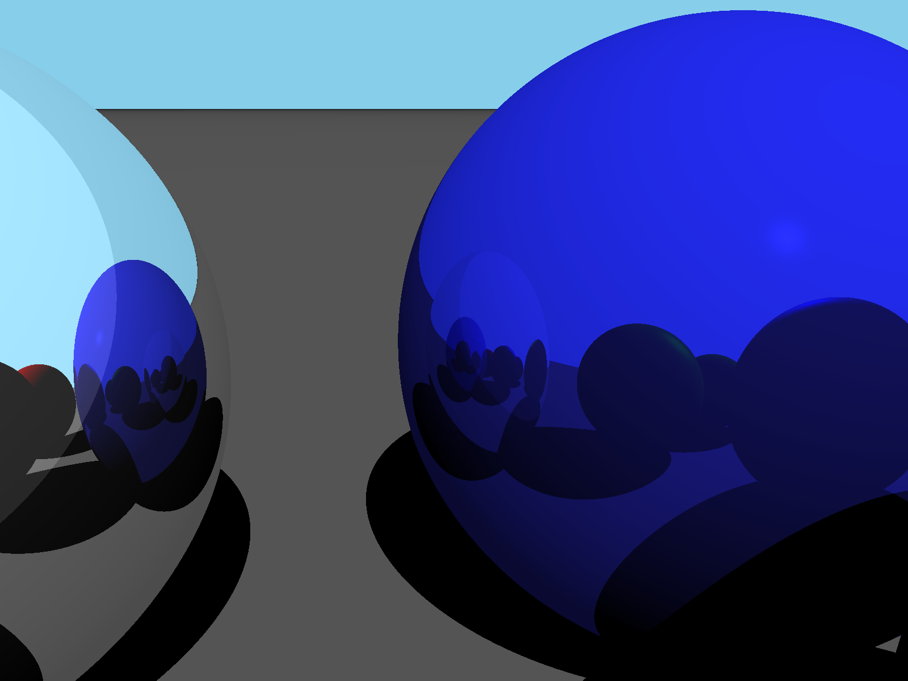
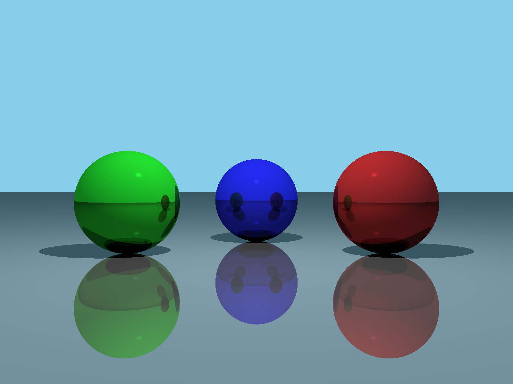

# Ray

Ray is final project for my programming classes at my university.   
It involves creating basic cpu raytracer capable of rendering basic primitives.  
All calculations are made on CPU, OpenMP is used for multithreding.  
At now screen resolution and scene definition is hardcoded in *main.cpp*

## Features

- Materials: Diffuse, Phong
- Primitives: Sphere, Plane, Cylinder
- Reflections
- Multithreading with OpenMP
- Basic scene runs in realtime with 800x600 resolution on my i5-4200H CPU

## Usage
- Run Visual Studio project and compile it
- Run exe in build folder
- **WSAD** is used for camera movement
- **Ctrl** and **Space** moves camera in vertical direction
- For camera rotation hold **LMB** and move mouse
- **B** key is used for .bmp screenshot

## Screenshots

